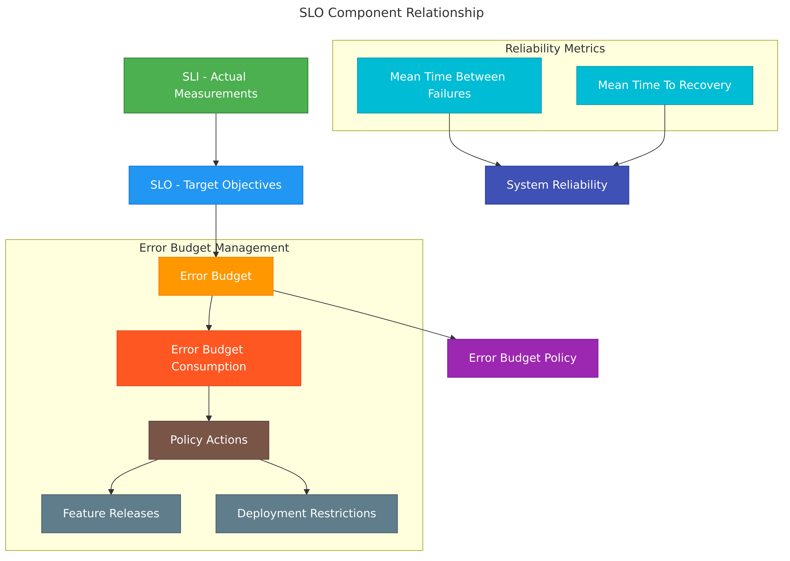
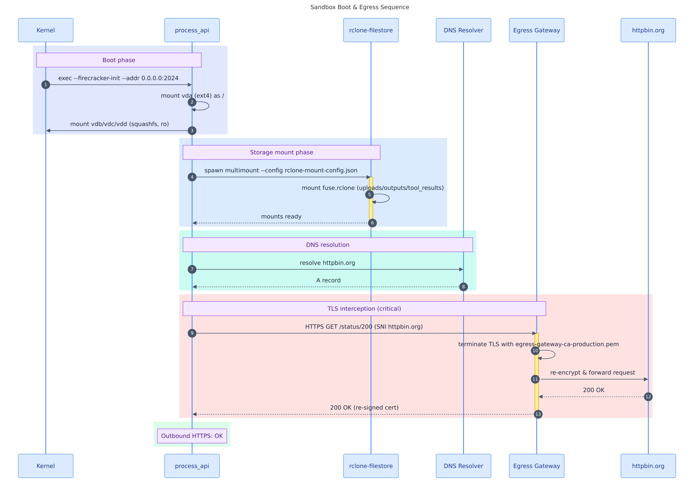

# mermaid-render

**Render [Mermaid](https://mermaid.js.org/) diagrams from Markdown to SVG, PNG, PDF, JPG, GIF, or WebP. Can read from local files, directories, or URLs.**<br>A self-contained wrapper script (compatible with **bash** and **zsh**) scans every ` ```mermaid ` fenced block in a Markdown file and renders each one to a numbered image using the [`ghcr.io/rondomondo/mermaid-render`](https://ghcr.io/rondomondo/mermaid-render) docker image, which is a thin layer on top of [`minlag/mermaid-cli`](https://hub.docker.com/r/minlag/mermaid-cli).

Point it at a local file, a whole directory, or a remote URL and it outputs PNG, JPG, WEBP, GIF, SVG or PDF images alongside a companion markdown file with image links already applied. Suitable for local development, AI Agentic/Skill use, CI pipelines, and documentation workflows.

> **Also available as an [Agent Skill](#claude-code-skill)** -- install it to render diagrams directly from Claude Code with no terminal required. Use the `/mermaid-render` slash command or just describe what you want in plain English and your AI Agent will handle it.


## Quick Start
_*assuming [install](#installation) has been done*_


```bash
# generate png images of diagrams from a local markdown file
mermaid-render examples/example1.md --format png

# remote URL -- fetches and generates diagrams from a remote file with no download needed
mermaid-render "https://alertstack.io/mermaid/examples/example1.md"
```


## Installation

### Option 1 -- pull the Docker image running built in install (recommended)

```bash
docker run --rm ghcr.io/rondomondo/mermaid-render install > mermaid-render && chmod +x mermaid-render
```

Then install system-wide:

```bash
install -m 755 mermaid-render /usr/local/bin/mermaid-render
```

Or use `./mermaid-render` directly from the current directory.

### Option 2 -- clone this repo

```bash
git clone https://github.com/rondomondo/toolbox.git && cd mermaid-render
make install        # copies mermaid-render to /usr/local/bin
```

To install to a different directory:

```bash
make install DESTDIR=~/bin
```

Verify the install worked:

```bash
make check
```

---

---

## Usage

```
mermaid-render                         Show help, then mmdc built-in help
mermaid-render -h | --help             Show help only
mermaid-render <input.md> [opts]       Render all diagrams in a Markdown file
mermaid-render <URL> [opts]            Fetch a remote .md and render its diagrams
mermaid-render <directory> [opts]      Render every .md with mermaid blocks in a directory
mermaid-render <md1> <md2> [opts]      Render multiple files (opts apply to all)
mermaid-render -- [args...]            Pass args directly to mmdc inside Docker
```

```
Options:
  -f, --format <fmt>    Output format: svg (default), png, pdf, jpg, gif, webp
  -t, --theme <theme>   Mermaid theme: default, dark, forest, neutral
  -b, --bg <color>      Background colour (e.g. white, transparent, '#f5f5f5')
  -w, --width <px>      Diagram width in pixels
  -H, --height <px>     Diagram height in pixels  (uppercase -H; -h is taken by --help)
  -s, --scale <n>       Pixel density / scale factor (use 2-3 for retina PNG)
```

---

## Examples

### SVG output (default)

```bash
mermaid-render examples/example1.md
```

### PNG at a custom size

```bash
mermaid-render examples/example1.md --format png --width 960 --height 640
```

Example output:

```
Found 3 mermaid charts in Markdown input
 ✅ ./example1.md-1.png
 ✅ ./example1.md-3.png
 ✅ ./example1.md-2.png
```

### PNG with dark theme and high pixel density ()

```bash
mermaid-render examples/example1.md -f png -t dark -s 3
```

### PNG with a coloured background

```bash
mermaid-render examples/example1.md --format png --width 640 --height 480 --bg '#99aacc'
```

### PDF export

```bash
mermaid-render examples/example1.md --format pdf
```

### Render a remote URL

```bash
mermaid-render "https://alertstack.io/mermaid/examples/example1.md"
mermaid-render "https://alertstack.io/mermaid/examples/example1.md" --format png --scale 2
```

Fetches the Markdown from the URL and renders all mermaid blocks -- no manual download required.

### Render an entire directory

```bash
mermaid-render examples/ --format png
```

Finds every `.md` file (up to two levels deep) containing a mermaid block and renders each one.

### Pass args directly to mmdc

```bash
mermaid-render -- --help
mermaid-render -- -i /data/examples/example1.md -o /data/out.svg
```

The `--` sentinel mounts `$PWD` at `/data` and forwards all remaining args straight to `mmdc`.

---

## Output files

For an input file `examples/example1.md` rendered as PNG, the tool produces:

| File | Description |
|---|---|
| `examples/example1.md-1.png` | First rendered diagram |
| `examples/example1.md-2.png` | Second rendered diagram |
| `...` | ... |
| `examples/example.png.md` | Companion Markdown with `` image links |

**Naming scheme:** image files are named `<input-filename>-<N>.<format>` (e.g. `example.md-1.png`). The companion Markdown is named `<input-stem>.<format>.md` (e.g. `example.png.md`).

The original `.md` file is **never modified**.

---

## How it works

1. `mermaid-render` locates the Docker socket on your host (checking several common paths) and mounts `$PWD` at `/data` inside the container.
2. The container runs `mmdc` (from `minlag/mermaid-cli`) via the `ghcr.io/rondomondo/mermaid-render` entrypoint, which sets `HOST_PWD` so the working directory inside the container matches your host path.
3. `mmdc` iterates over every ` ```mermaid ` block in the input file and renders each one to a numbered image file.
4. It writes a companion Markdown file (e.g. `example.png.md`) where the code blocks are replaced with standard `` image references -- ready to embed in GitHub, GitLab, Notion, or any Markdown renderer that serves local images.
5. The container runs as the current user (`-u $(id -u):$(id -g)`) so all output files are owned by you, not root.

---

## Debugging

Set `DEBUG=true` to enable verbose logging:

```bash
DEBUG=true mermaid-render examples/example1.md
```

---

## Sample output

Produced by running:

```bash
mermaid-render examples/example1.md --format png --width 960 --height 640 --scale 3
```

### Example 1 diagrams

| SLO Component Relationship | Sandbox Boot & Egress Sequence |
|:---:|:---:|
|  |  |
| Flowchart linking SLI → SLO → Error Budget → Policy, with MTBF/MTTR feeding into system reliability | Sequence diagram of sandbox boot phases: kernel init, storage mounts, DNS resolution, and TLS egress interception |

---

## Claude Code skill

<details>
<summary>Install the <code>/mermaid-render</code> slash command for Claude Code</summary>

This repository ships a `/mermaid-render` slash command skill for [Claude Code](https://claude.ai/code) that lets Claude render your diagrams -- no terminal required. The skill automatically detects which render path to use:

| Environment | How it renders |
|---|---|
| **Claude Code sandbox** (`IS_SANDBOX=yes`) | Uses `mmdc` directly with bundled Chromium -- no Docker needed |
| **Local / non-sandbox** | Uses `mermaid-render` backed by Docker (`ghcr.io/rondomondo/mermaid-render`) |

### What it accepts

| Input | Example |
|---|---|
| Single file | `examples/example1.md` |
| Local directory | `examples/` -- renders every `.md` with a mermaid block |
| URL (file) | `https://alertstack.io/mermaid/examples/example1.md` |

### Invoking the skill

Use the slash command directly:

```
/mermaid-render examples/example1.md
/mermaid-render examples/example2.md --format webp --scale 3
/mermaid-render examples/ -f png -t forest
/mermaid-render "https://alertstack.io/mermaid/examples/example2.md"
```

Or just describe what you want in natural language -- Claude will invoke the skill automatically:

> *"I've got a folder of documents at examples/ that has some architecture diagrams in it -- can you render them all?"*
>
> *"Export examples/example2.md as a PNG at double resolution"*
>
> *"I have some sequence diagrams and architecture charts in a markdown doc. Can you turn them into images?"*

### Installing the skill

#### Option A -- upload ZIP to Claude.ai (web UI)

1. Download or build the skill ZIP:

   ```bash
   cd mermaid-render
   zip -r mermaid-render-skill.zip SKILL.md mermaid-render examples references evals
   ```

2. Open [claude.ai/code](https://claude.ai/code), go to **Settings > Skills**, and upload `mermaid-render-skill.zip`.

3. The `/mermaid-render` command becomes available in any Claude Code conversation.

#### Option B -- install locally via `make`

Copy the skill files into your project's `.claude/skills/` directory so Claude Code picks them up automatically:

```bash
# from inside the mermaid-render directory
make sync-skill
```

This syncs `SKILL.md`, `mermaid-render`, `examples`, `references`, and `evals` to:

```
~/Code/agent-skills-toolbox/skills/mermaid-render/
```

Override the target directory with `SKILLS_DIR`:

```bash
make sync-skill SKILLS_DIR=/path/to/your/project/.claude/skills/mermaid-render
```

#### Option C -- copy manually

```bash
mkdir -p .claude/skills/mermaid-render
cp SKILL.md mermaid-render .claude/skills/mermaid-render/
```

</details>

---

## Tips

- Use `--scale 2` or `--scale 3` for retina/HiDPI exports.
- Combine `--bg transparent` with SVG or PNG output for diagrams you embed in dark-mode docs.
- Run `mermaid-render --` to pass flags directly to `mmdc` for options not covered by this wrapper.
- Run `mermaid-render -h` at any time to print the built-in help.
- Run `mermaid-render`    at any time to print the combined built-in help.


---

## Requirements

- **Docker** installed and running locally
- **bash** (3.2+) or **zsh**

