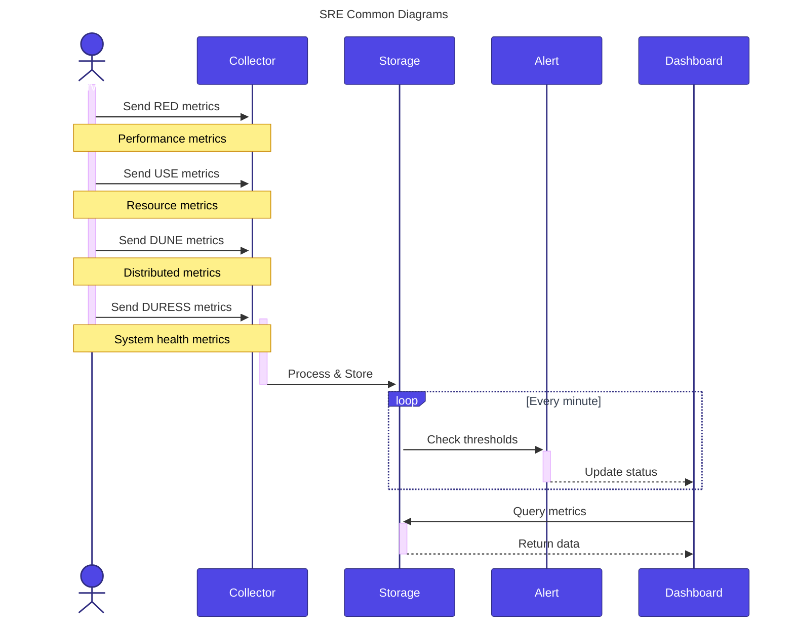
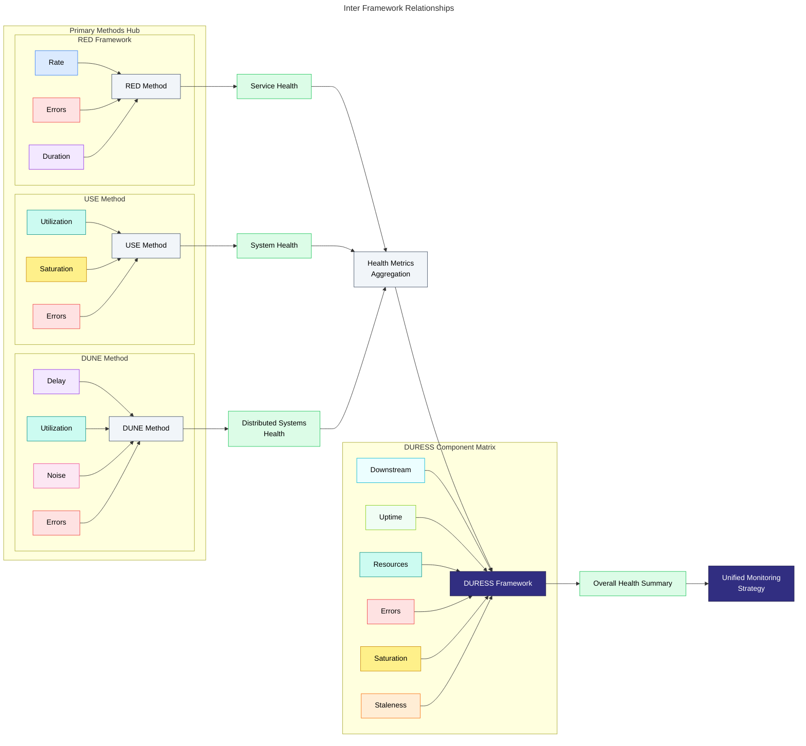
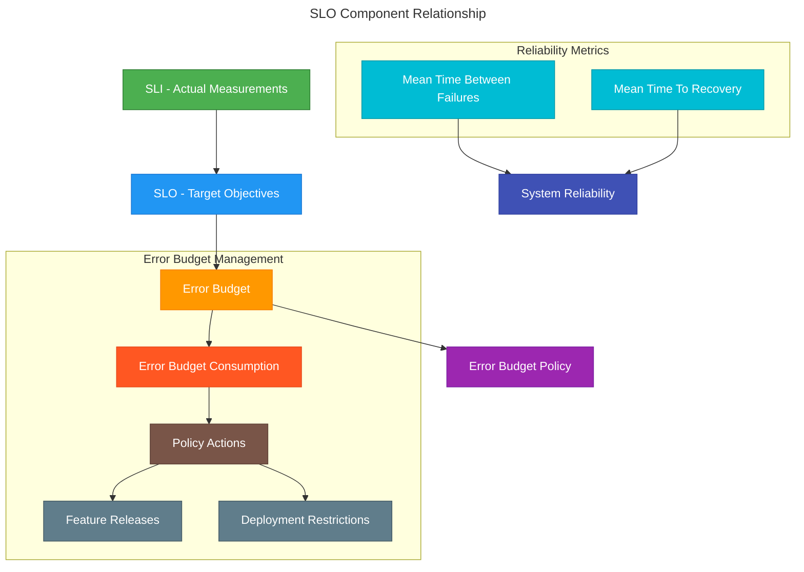
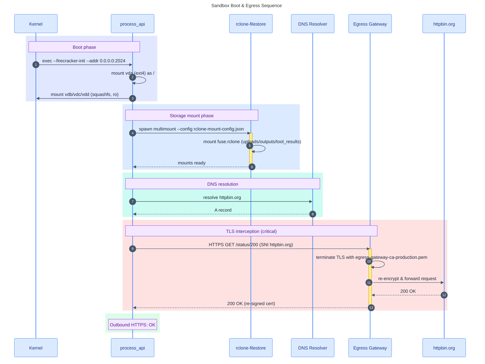

# SRE Common Diagrams

```mermaid
---
title: SRE Common Diagrams
---

%%{init: { 'theme': 'base', 'themeVariables': {
    'actorBkg': '#4F46E5',
    'actorTextColor': '#fff',
    'actorBorder': '#312E81',
    'actorLineColor': '#312E81',
    
    'participantBkg': '#DBEAFE',
    'participantTextColor': '#000',
    'participantBorder': '#3B82F6',
    
    'messageFontSize': '14px',
    'messageFontFamily': 'ui-sans-serif, system-ui',
    'messageTextColor': '#111827',
    
    'noteBkgColor': '#FEF08A',
    'noteTextColor': '#000',
    'noteBorderColor': '#CA8A04',
    
    'loopTextColor': '#374151',
    'loopBorderColor': '#F97316',
    'loopBkgColor': '#FFEDD5',
    
    'mainBkg': '#FAFAFA'
}}}%%

sequenceDiagram
    actor Service
    participant Collector
    participant Storage
    participant Alert
    participant Dashboard
    
    activate Service
    Service->>+Collector: Send RED metrics
    Note over Service,Collector: Performance metrics
    Service->>+Collector: Send USE metrics
    Note over Service,Collector: Resource metrics
    Service->>+Collector: Send DUNE metrics
    Note over Service,Collector: Distributed metrics
    Service->>+Collector: Send DURESS metrics
    Note over Service,Collector: System health metrics
    deactivate Service
    
    Collector->>+Storage: Process & Store
    deactivate Collector
    
    loop Every minute
        Storage->>+Alert: Check thresholds
        Alert-->>-Dashboard: Update status
    end
    
    Dashboard->>+Storage: Query metrics
    Storage-->>-Dashboard: Return data

```

## Relationship between frameworks

```mermaid
---
title: Inter Framework Relationships
---
graph LR
    subgraph Primary Methods ["Primary Methods Hub"]
        direction TB
        
        subgraph RED Framework
            R["Rate"]:::blue --> RED["RED Method"]:::slate
            E1["Errors"]:::red --> RED
            D1["Duration"]:::purple --> RED
        end
        
        subgraph USE Method
            U1["Utilization"]:::teal --> USE["USE Method"]:::slate
            S1["Saturation"]:::yellow --> USE
            E2["Errors"]:::red --> USE
        end
        
        subgraph DUNE Method
            D2["Delay"]:::purple --> DUNE["DUNE Method"]:::slate
            U2["Utilization"]:::teal --> DUNE
            N["Noise"]:::pink --> DUNE
            E3["Errors"]:::red --> DUNE
        end
    end
    
    RED --> ServiceHealth["Service Health"]:::green
    USE --> SystemHealth["System Health"]:::green
    DUNE --> DistributedHealth["Distributed Systems<br>Health"]:::green
    
    ServiceHealth --> Aggregation["Health Metrics<br>Aggregation"]:::slate
    SystemHealth --> Aggregation
    DistributedHealth --> Aggregation
    
    Aggregation --> DURESS["DURESS Framework"]:::indigowhite
    
    subgraph DURESS System ["DURESS Component Matrix"]
        D3["Downstream"]:::cyan --> DURESS
        U3["Uptime"]:::lime --> DURESS
        R1["Resources"]:::teal --> DURESS
        E4["Errors"]:::red --> DURESS
        S2["Saturation"]:::yellow --> DURESS
        S3["Staleness"]:::orange --> DURESS
    end
    
    DURESS --> OverallHealth["Overall Health Summary"]:::green
    OverallHealth --> MonitoringStrategy["Unified Monitoring<br>Strategy"]:::indigowhite

    %% Standardised Class Library Definitions
    classDef red fill:#FEE2E2,stroke:#EF4444,color:#000
    classDef orange fill:#FFEDD5,stroke:#F97316,color:#000
    classDef yellow fill:#FEF08A,stroke:#CA8A04,color:#000
    classDef green fill:#DCFCE7,stroke:#22C55E,color:#000
    classDef teal fill:#CCFBF1,stroke:#0D9488,color:#000
    classDef blue fill:#DBEAFE,stroke:#3B82F6,color:#000
    classDef purple fill:#F3E8FF,stroke:#9333EA,color:#000
    classDef pink fill:#FCE7F3,stroke:#EC4899,color:#000
    classDef lime fill:#F0FDF4,stroke:#84CC16,color:#000
    classDef cyan fill:#ECFEFF,stroke:#06B6D4,color:#000
    classDef slate fill:#F1F5F9,stroke:#475569,color:#000
    classDef indigowhite fill:#312E81,stroke:#1E1B4B,color:#FFF

```

## SLO Component Relationship

```mermaid
---
title: SLO Component Relationship
---

flowchart TB
    SLI[SLI - Actual Measurements]:::measurementNode --> SLO[SLO - Target Objectives]:::objectiveNode
    SLO --> EB[Error Budget]:::budgetNode
    EB --> EBP[Error Budget Policy]:::policyNode
    
    subgraph Reliability Metrics
    MTBF[Mean Time Between Failures]:::timeMetricNode
    MTTR[Mean Time To Recovery]:::timeMetricNode
    end
    
    MTBF --> REL[System Reliability]:::reliabilityNode
    MTTR --> REL
    
    subgraph Error Budget Management
    EB --> EBC[Error Budget Consumption]:::consumptionNode
    EBC --> EPA[Policy Actions]:::actionNode
    EPA --> FR[Feature Releases]:::outputNode
    EPA --> DR[Deployment Restrictions]:::outputNode
    end

    classDef measurementNode fill:#4CAF50,stroke:#2E7D32,color:white
    classDef objectiveNode fill:#2196F3,stroke:#1976D2,color:white
    classDef budgetNode fill:#FF9800,stroke:#F57C00,color:white
    classDef policyNode fill:#9C27B0,stroke:#7B1FA2,color:white
    classDef timeMetricNode fill:#00BCD4,stroke:#0097A7,color:white
    classDef reliabilityNode fill:#3F51B5,stroke:#303F9F,color:white
    classDef consumptionNode fill:#FF5722,stroke:#E64A19,color:white
    classDef actionNode fill:#795548,stroke:#5D4037,color:white
    classDef outputNode fill:#607D8B,stroke:#455A64,color:white

    classDef subgraphStyle fill:#f5f5f5,stroke:#cccccc,stroke-width:2px
    class ReliabilityMetrics,ErrorBudgetManagement subgraphStyle
```

## Sandbox Boot & Egress Sequence

```mermaid
---
title: Sandbox Boot & Egress Sequence
---
%%{init: {
  'theme': 'base',
  'themeVariables': {
    'actorBkg': '#DBEAFE',
    'actorBorder': '#3B82F6',
    'actorTextColor': '#1E3A8A',
    'activationBkgColor': '#FEF08A',
    'activationBorderColor': '#CA8A04',
    'noteBkgColor': '#F3E8FF',
    'noteBorderColor': '#9333EA',
    'noteTextColor': '#581C87',
    'signalColor': '#475569',
    'signalTextColor': '#1E293B',
    'labelBoxBkgColor': '#DCFCE7',
    'labelBoxBorderColor': '#22C55E',
    'labelTextColor': '#14532D',
    'sequenceNumberColor': '#FFFFFF'
  }
}}%%
sequenceDiagram
    autonumber
    participant K as Kernel
    participant PA as process_api
    participant RC as rclone-filestore
    participant DNS as DNS Resolver
    participant EGW as Egress Gateway
    participant UP as httpbin.org

    rect rgb(224, 231, 255)
    Note over K,PA: Boot phase
    K->>PA: exec --firecracker-init --addr 0.0.0.0:2024
    PA->>PA: mount vda (ext4) as /
    PA->>K: mount vdb/vdc/vdd (squashfs, ro)
    end

    rect rgb(219, 234, 254)
    Note over PA,RC: Storage mount phase
    PA->>RC: spawn multimount --config rclone-mount-config.json
    activate RC
    RC->>RC: mount fuse.rclone (uploads/outputs/tool_results)
    RC-->>PA: mounts ready
    deactivate RC
    end

    rect rgb(204, 251, 241)
    Note over PA,DNS: DNS resolution
    PA->>DNS: resolve httpbin.org
    DNS-->>PA: A record
    end

    rect rgb(254, 226, 226)
    Note over PA,EGW: TLS interception (critical)
    PA->>EGW: HTTPS GET /status/200 (SNI httpbin.org)
    activate EGW
    EGW->>EGW: terminate TLS with egress-gateway-ca-production.pem
    EGW->>UP: re-encrypt & forward request
    UP-->>EGW: 200 OK
    EGW-->>PA: 200 OK (re-signed cert)
    deactivate EGW
    end

    rect rgb(220, 252, 231)
    Note over PA: Outbound HTTPS: OK
    end
```
