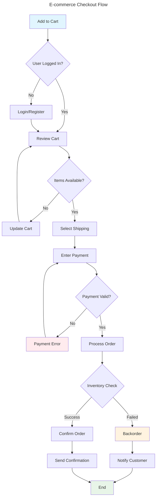
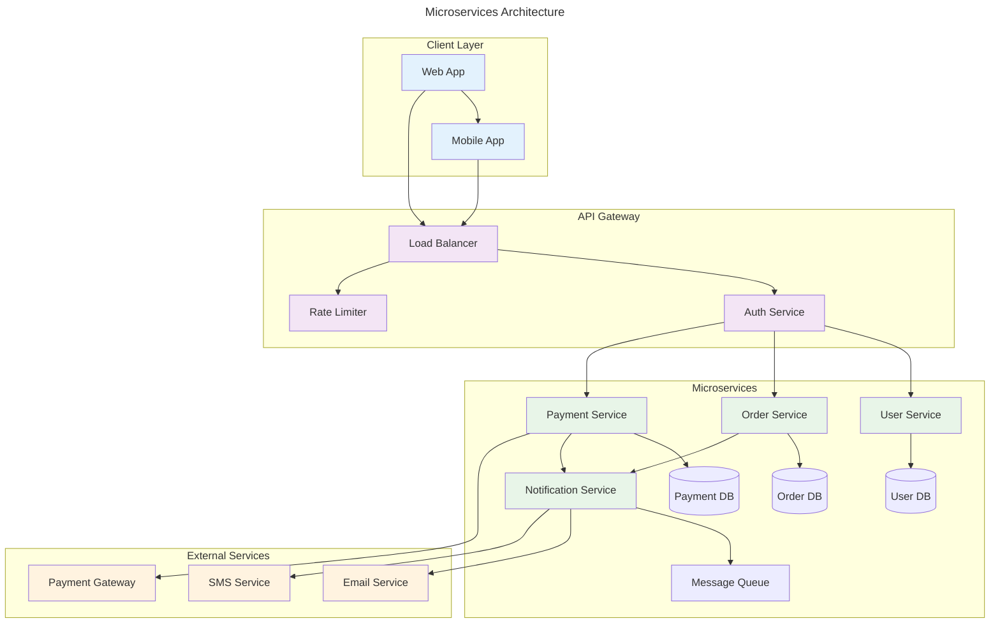
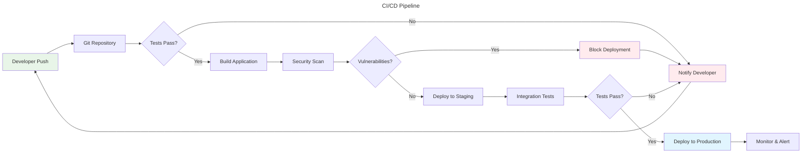
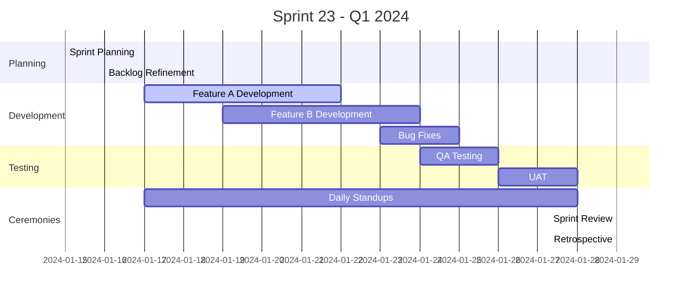
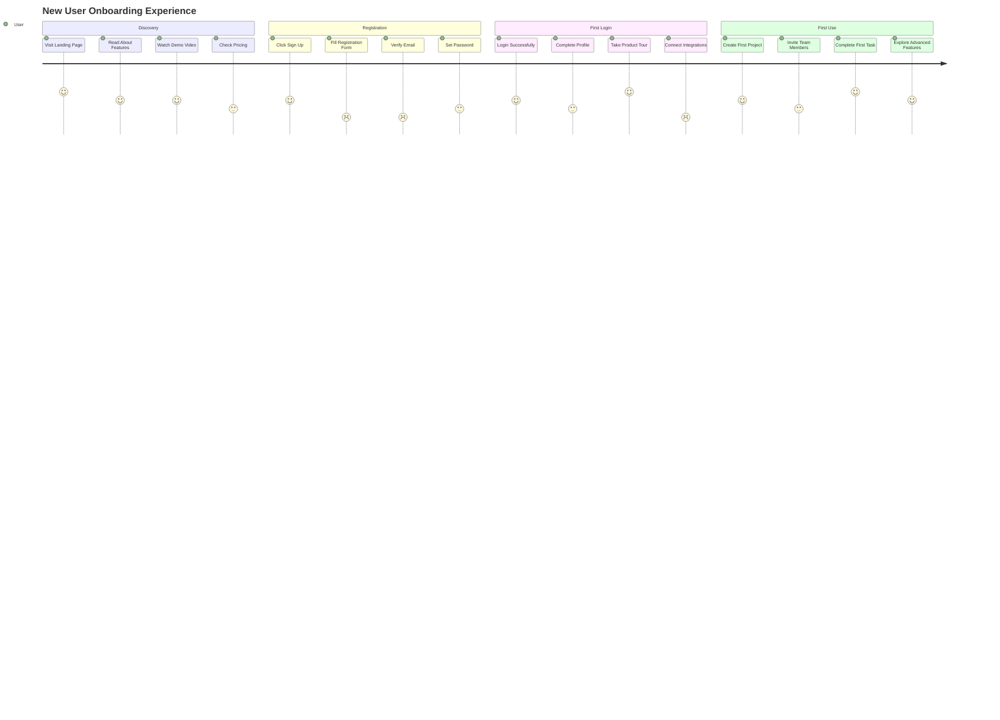
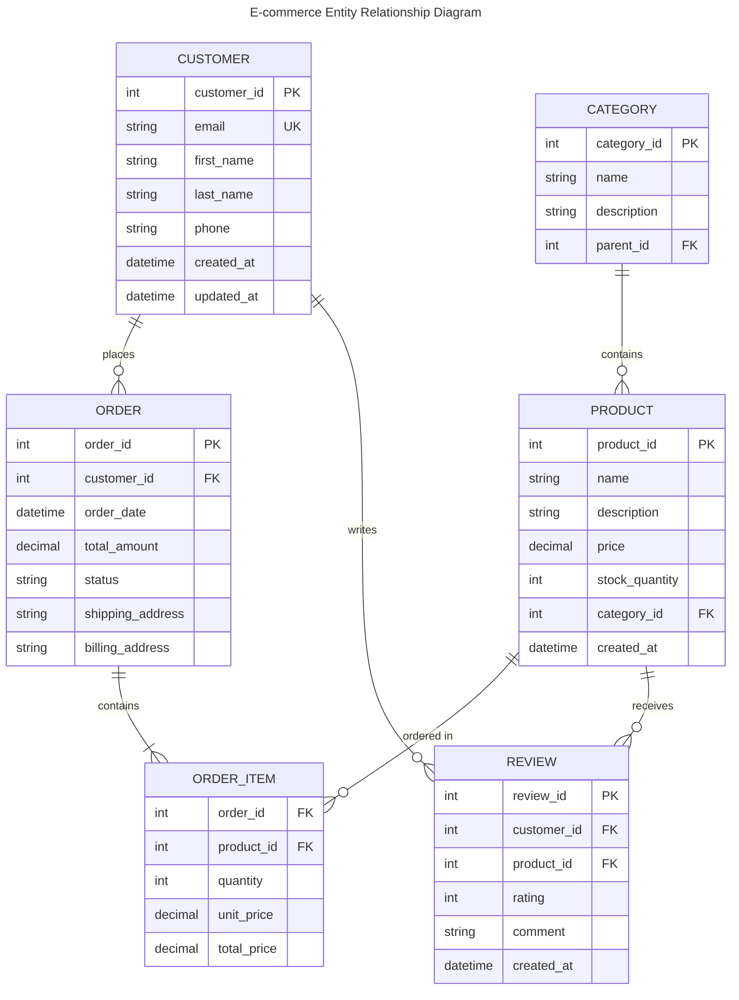
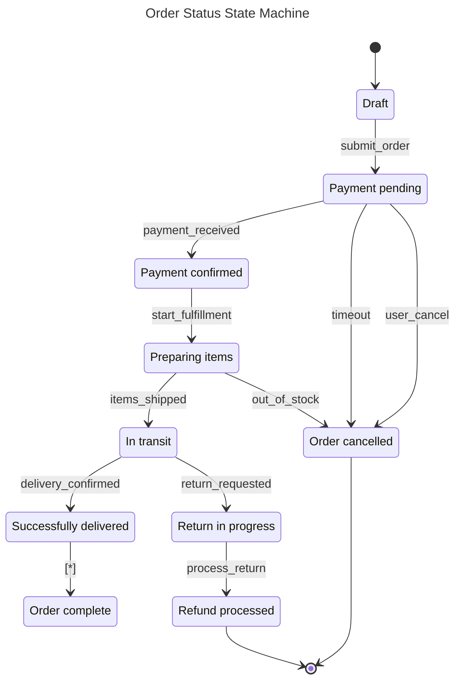
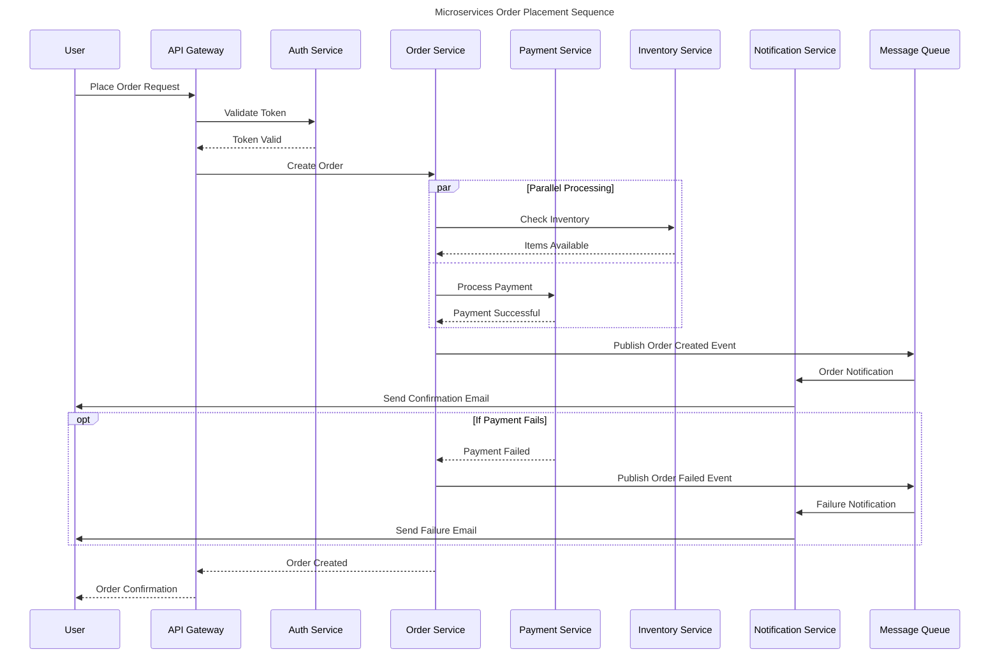

# E-commerce Checkout Flow

# Microservices Architecture

# CI/CD Pipeline

# Sprint Gantt Chart

# User Onboarding Journey

# E-commerce Entity Relationship Diagram

# Order Status State Machine

# Microservices Order Placement Sequence

