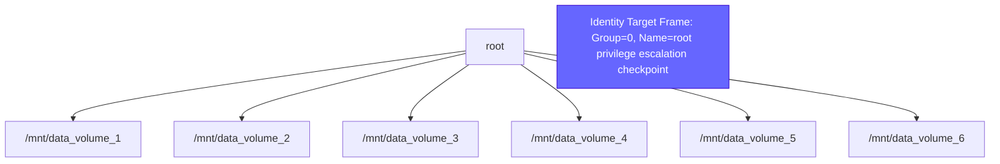
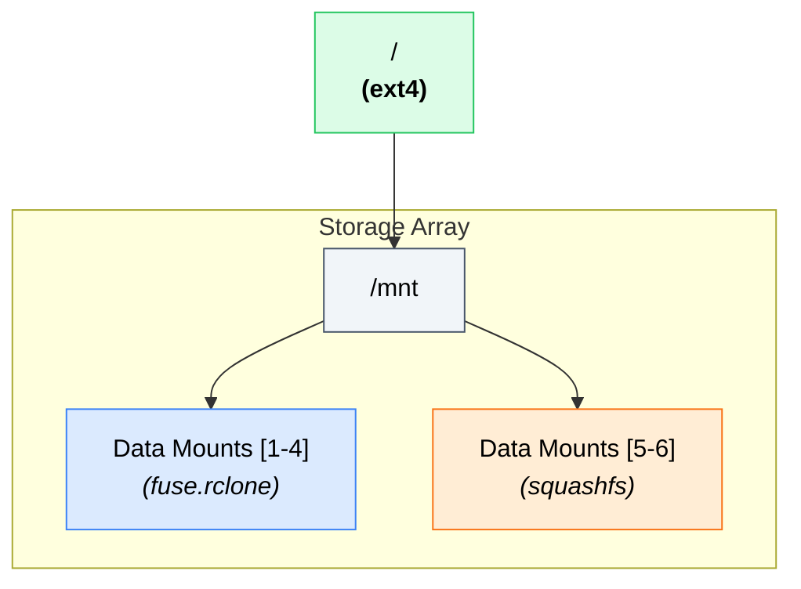
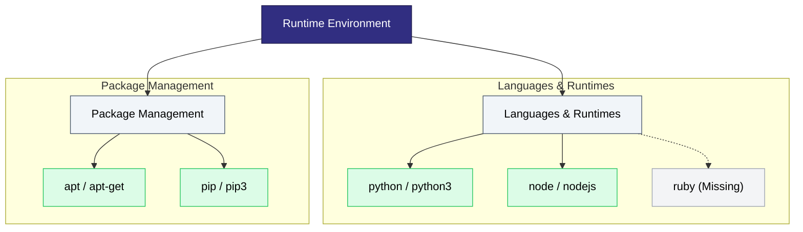

# Mermaid Diagram Architecture & Style Standards

## 1. Executive Summary

When generating structural or technical visualisations using Mermaid, optimise for immediate human
scannability, accessibility, and high spatial efficiency. Diagrams are frequently consumed on
landscape-oriented viewports (monitors, laptops) or scaled significantly downward on mobile devices.

**Core Imperative:** Never output an unstructured "hairball" or a massive, single-line linear
sequence that forces infinite horizontal or vertical scrolling. Diagrams must remain compact,
responsive, and legible on relatively small displays.

---

## 2. Layout & Spatial Rules

### Flow Direction

* **`graph TD` (Top-Down):** Default for hierarchical trees, directory/mount maps, organisational
  layouts, and categorised architecture hubs. Clusters horizontal elements gracefully and scales
  cleanly with normal page text flow.
* **`graph LR` (Left-to-Right):** Restrict to multi-step linear pipelines or sequential workflows
  with fewer than 5 total nodes.

### Viewport Conservation

* **Horizontal Sibling Threshold:** Never allow more than 4-5 sibling nodes under a single parent.
* **Subgraphs:** If a structural group exceeds 4 nodes, group logically into subgraphs or compress
  related aliases into a single element (e.g. `python / python3` instead of two separate nodes).
* **Text Wrapping:** Use HTML `<br>` tags to control node dimensions. Raw `\n` is handled
  unpredictably across markdown viewers and frequently clips text outside node boundaries.

---

## 3. Colour Palette (classDefs)

Apply these to any `flowchart` or `graph` diagram. Each colour has two variants: standard dark
text (`color:#000`) and white text (`color:#FFF`, suffixed with `white`). Use the `white` variant
when the fill is dark enough that black text would be illegible.

```
%% Full Standardised Color Palette

classDef red fill:#FEE2E2,stroke:#EF4444,color:#000
classDef redwhite fill:#EF4444,stroke:#991B1B,color:#FFF
classDef lightred fill:#FEF2F2,stroke:#FCA5A5,color:#000
classDef lightredwhite fill:#FCA5A5,stroke:#991B1B,color:#FFF
classDef orange fill:#FFEDD5,stroke:#F97316,color:#000
classDef orangewhite fill:#F97316,stroke:#7C2D12,color:#FFF
classDef yellow fill:#FEF08A,stroke:#CA8A04,color:#000
classDef yellowwhite fill:#EAB308,stroke:#713F12,color:#FFF
classDef green fill:#DCFCE7,stroke:#22C55E,color:#000
classDef greenwhite fill:#22C55E,stroke:#14532D,color:#FFF
classDef teal fill:#CCFBF1,stroke:#0D9488,color:#000
classDef tealwhite fill:#0D9488,stroke:#115E59,color:#FFF
classDef blue fill:#DBEAFE,stroke:#3B82F6,color:#000
classDef bluewhite fill:#1D4ED8,stroke:#1E3A8A,color:#FFF
classDef indigo fill:#E0E7FF,stroke:#4F46E5,color:#000
classDef indigowhite fill:#312E81,stroke:#1E1B4B,color:#FFF
classDef purple fill:#F3E8FF,stroke:#9333EA,color:#000
classDef purplewhite fill:#9333EA,stroke:#581C87,color:#FFF
classDef pink fill:#FCE7F3,stroke:#EC4899,color:#000
classDef pinkwhite fill:#EC4899,stroke:#701A75,color:#FFF
classDef magenta fill:#FAE8FF,stroke:#D946EF,color:#000
classDef magentawhite fill:#D946EF,stroke:#701A75,color:#FFF
classDef brown fill:#F5EBE0,stroke:#8B5A2B,color:#000
classDef brownwhite fill:#8B5A2B,stroke:#4A2711,color:#FFF
classDef lime fill:#F0FDF4,stroke:#84CC16,color:#000
classDef limewhite fill:#84CC16,stroke:#365314,color:#FFF
classDef cyan fill:#ECFEFF,stroke:#06B6D4,color:#000
classDef cyanwhite fill:#06B6D4,stroke:#164E63,color:#FFF
classDef slate fill:#F1F5F9,stroke:#475569,color:#000
classDef slatewhite fill:#475569,stroke:#0F172A,color:#FFF
classDef grey fill:#F3F4F6,stroke:#9CA3AF,color:#000
classDef greywhite fill:#9CA3AF,stroke:#374151,color:#FFF
classDef black fill:#444444,stroke:#000000,color:#FFF
classDef blackwhite fill:#111111,stroke:#000000,color:#FFF
```

### Palette Quick-Reference

| Name      | Fill (standard) | Stroke     | `white` variant fill | Use `white` variant when...        |
|-----------|-----------------|------------|----------------------|------------------------------------|
| red       | #FEE2E2         | #EF4444    | #EF4444              | solid red fill needed              |
| lightred  | #FEF2F2         | #FCA5A5    | #FCA5A5              | softer red needed                  |
| orange    | #FFEDD5         | #F97316    | #F97316              | solid amber fill needed            |
| yellow    | #FEF08A         | #CA8A04    | #EAB308              | solid yellow fill needed           |
| green     | #DCFCE7         | #22C55E    | #22C55E              | solid green fill needed            |
| teal      | #CCFBF1         | #0D9488    | #0D9488              | solid teal fill needed             |
| blue      | #DBEAFE         | #3B82F6    | #1D4ED8              | dark blue background               |
| indigo    | #E0E7FF         | #4F46E5    | #312E81              | dark indigo - always use white     |
| purple    | #F3E8FF         | #9333EA    | #9333EA              | solid purple fill needed           |
| pink      | #FCE7F3         | #EC4899    | #EC4899              | solid pink fill needed             |
| magenta   | #FAE8FF         | #D946EF    | #D946EF              | solid magenta fill needed          |
| brown     | #F5EBE0         | #8B5A2B    | #8B5A2B              | solid brown fill needed            |
| lime      | #F0FDF4         | #84CC16    | #84CC16              | solid lime fill needed             |
| cyan      | #ECFEFF         | #06B6D4    | #06B6D4              | solid cyan fill needed             |
| slate     | #F1F5F9         | #475569    | #475569              | dark structural header             |
| grey      | #F3F4F6         | #9CA3AF    | #9CA3AF              | inactive/absent nodes              |
| black     | #444444         | #000000    | #111111              | always use white text              |

### Semantic Defaults

While the full palette is available, default to these mappings for data, system, and security diagrams:

| Class            | System Role                                                                    |
|------------------|--------------------------------------------------------------------------------|
| `:::indigowhite` | Primary Anchor / Core Subject - root nodes, central identities, system origins |
| `:::red`         | Critical Risk / High Privilege - writeable root filesystems, critical vulns    |
| `:::orange`      | Warning / Read-Only Layer - compressed filesystems, unverified filters         |
| `:::green`       | Success / Standard Active - healthy environments, verified native configs      |
| `:::blue`        | User-Space Focus - custom home dirs, user profiles, local context boundaries   |
| `:::slate`       | Structural Header - intermediate path boundaries, grouping frames, category hubs |
| `:::grey`        | Inactive / Absent - missing modules, legacy libraries, disconnected paths      |

### Applying classDefs

Assign a class inline with `:::` or via a `class` statement:

```
flowchart LR
    A[Start]:::green --> B[Process]:::bluewhite --> C[End]:::red

    classDef green fill:#DCFCE7,stroke:#22C55E,color:#000
    classDef bluewhite fill:#1D4ED8,stroke:#1E3A8A,color:#FFF
    classDef red fill:#FEE2E2,stroke:#EF4444,color:#000
```

Apply to multiple nodes at once with a `class` statement:

```
class A,B green
class C,D bluewhite
```

---

## 4. Visual Anti-Patterns

* **Orphan Variable Trap:** Do not assign a relationship from an undeclared node. All branches must
  trace logically back to the root.
* **Overwhelming Sibling Rows:** Do not build flat arrays of dozens of components on a single hub.
  Force logical structural tiers using subgraphs or text grouping.
* **Duplicated Visual Strings:** Consolidate duplicated nodes with incremented indices (e.g.
  `binary1`, `binary2`) into a unified multi-value category node.
* **Ambiguous Connectors:** Do not use plain undirected lines (`---`) for system flows, security
  relationships, or infrastructure trees. Use explicit directional arrows (`-->`) or conditional
  linkages (`-.->`).

---

## 5. Blueprint Examples

### Infrastructure Mapping

#### Bad (too wide, unbounded text, illegible contrast)



#### Good (compressed horizontal plane, high contrast, categorised)



### System Availability

#### Good (multi-category subgraph clustering)


